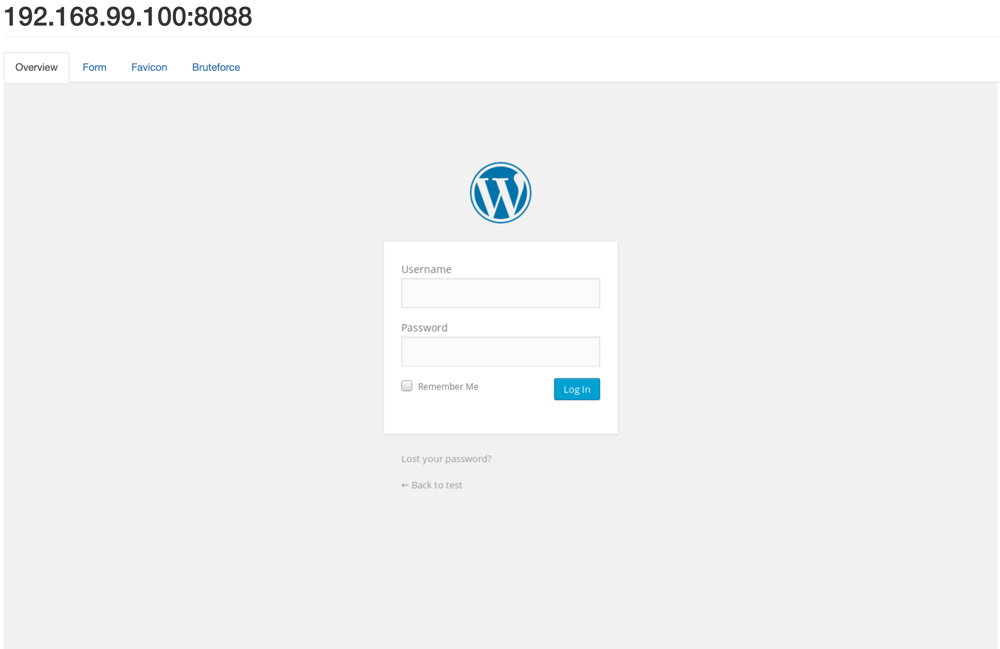
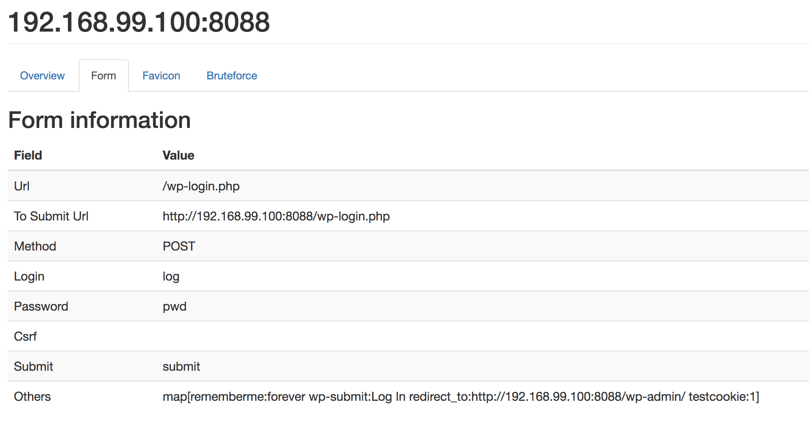
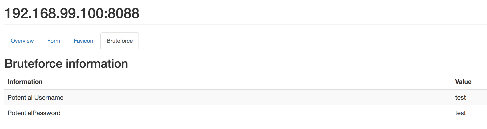

# no-name [](https://circleci.com/gh/Yinkozi/no-name) [](https://codecov.io/gh/v4lproik/no-name)

This program has been designed to extract the information of a web login interface in order to craft a request that submits it.  

This project has been booted as it can be useful - especially during an internal pentest assessment, after extracting a list of web servers - to find a pair of credentials that allows you to get logged in as a privileged user.

## How does it work ?

Several modules have been implemented and the workflow of the program looks like this :
- Parse the ip addresses passed in parameter
- Load the configuration files of the program
- Scan the web interface and extract the web login form information
- Try to detect the type of web interface (wordpress, joomla, ...) through different patterns (feedbacks, favicons...)
- Search for default credentials in the database if the web interface has been recognised
- Bruteforce the form with a list of credentials
- Create a report file

## Environment Installation
1. Visit https://golang.org/doc/install
2. Install glide (MAC Osx : brew install glide)

## Compile
```
git clone https://github.com/v4lproik/no-name
cd no-name
glide install
go build main.go
```

## Run
```
./main --help
```

## Examples
```
./main -d db.txt  -f ip.txt -o html
12:58:48 INFO  main main.go:46
	|----------------------------------------------------------|
	|              Web Interface Auto Submit 1.3               |
	|                         v4lproik                         |
	|----------------------------------------------------------|

12:58:48 WARN  main main.go:149 Can't process line : <>
12:58:48 INFO  main main.go:203 key f528764d624db129b32c21fbca0cb8d6 value test
12:58:48 INFO  main main.go:203 key ab416c39d509e72c5a0a7451a45bc65e value test2
12:58:48 INFO  main main.go:209 - 192.168.99.100:8080/WebGoat/login
12:58:48 WARN  web simpleWebClient.go:24 No scheme for url 192.168.99.100:8080/WebGoat/login. Setting scheme to http://192.168.99.100:8080/WebGoat/login
12:58:48 DEBUG scrapmodule formModule.go:38 SubmitUrl has been found with action </WebGoat/login>
12:58:48 DEBUG scrapmodule formModule.go:44 MethodSubmit has been found with method <POST>
12:58:48 DEBUG scrapmodule formModule.go:58 Username input has been found with name <username>
12:58:48 DEBUG scrapmodule formModule.go:61 Password has been found with name <password>
12:58:48 DEBUG scrapmodule formModule.go:79 Password input has been found with type <password>
12:58:48 INFO  scrapmodule faviconModule.go:29 Start looking for a favicon
12:58:48 INFO  scrapmodule faviconModule.go:54 MD5 Favicon is : d41d8cd98f00b204e9800998ecf8427e
12:58:49 INFO  scrapmodule bruteforceModule.go:70 Potential credentials: <admintest/admintest>
12:58:49 INFO  scrapmodule reportModule.go:114 Report has been created at /Users/v4lproik/Programmation/go/src/github.com/v4lproik/no-name/report/report-2017-05-28_12:58:49.118983636_+0200_CEST_192.168.99.100:8080_5bf330a8-4767-407b-8fe9-462cbf617f32.html
```
```
14:21:36 INFO  main main.go:45
	|----------------------------------------------------------|
	|              Web Interface Auto Submit 1.3               |
	|                         v4lproik                         |
	|----------------------------------------------------------|

14:21:36 WARN  main main.go:148 Can't process line : <>
14:21:36 INFO  main main.go:202 key f528764d624db129b32c21fbca0cb8d6 value test
14:21:36 INFO  main main.go:202 key ab416c39d509e72c5a0a7451a45bc65e value test2
14:21:36 INFO  main main.go:208 - 192.168.99.100:8088/wp-login.php
14:21:36 WARN  web simpleWebClient.go:24 No scheme for url 192.168.99.100:8088/wp-login.php. Setting scheme to http://192.168.99.100:8088/wp-login.php
14:21:36 DEBUG scrapmodule formModule.go:38 SubmitUrl has been found with action <http://192.168.99.100:8088/wp-login.php>
14:21:36 DEBUG scrapmodule formModule.go:44 MethodSubmit has been found with method <post>
14:21:36 DEBUG scrapmodule formModule.go:58 Username input has been found with name <log>
14:21:36 DEBUG scrapmodule formModule.go:61 Password has been found with name <pwd>
14:21:36 DEBUG scrapmodule formModule.go:79 Password input has been found with type <password>
14:21:36 DEBUG scrapmodule formModule.go:95 Couple name=value has been found <rememberme=forever>
14:21:36 DEBUG scrapmodule formModule.go:75 Submit input has been found with type <submit>
14:21:36 DEBUG scrapmodule formModule.go:95 Couple name=value has been found <wp-submit=Log In>
14:21:36 DEBUG scrapmodule formModule.go:95 Couple name=value has been found <redirect_to=http://192.168.99.100:8088/wp-admin/>
14:21:36 DEBUG scrapmodule formModule.go:95 Couple name=value has been found <testcookie=1>
14:21:37 DEBUG scrapmodule bruteforceModule.go:66 Ratio <test/bug>0.985075
14:21:37 DEBUG scrapmodule bruteforceModule.go:66 Ratio <test/admin>0.985075
14:21:37 DEBUG scrapmodule bruteforceModule.go:66 Ratio <test/test>0.074194
14:21:37 INFO  scrapmodule bruteforceModule.go:70 Potential credentials: <test/test>
14:21:37 DEBUG scrapmodule bruteforceModule.go:66 Ratio <test/foo>0.985075
14:21:37 DEBUG scrapmodule bruteforceModule.go:66 Ratio <test/admintest>0.985075
14:21:37 DEBUG scrapmodule bruteforceModule.go:66 Ratio <test/guest>0.985075
14:21:37 DEBUG scrapmodule bruteforceModule.go:66 Ratio <test/user1_pass>0.985075
14:21:37 DEBUG scrapmodule bruteforceModule.go:66 Ratio <test/demo>0.985075
14:21:37 DEBUG scrapmodule bruteforceModule.go:66 Ratio <test/password>0.985075
14:21:37 INFO  scrapmodule reportModule.go:114 Report has been created at /Users/jrousseau/Programmation/go/src/github.com/v4lproik/no-name/report/report-2017-05-28_14:21:37.546175259_+0200_CEST_192.168.99.100:8088_d08d63ce-995f-43c6-9fa8-21a8fd31f635.html
```

## Reporting
Below, some report screenshots





## Test
1 - Download & Set up vulnerable boxes  
```
docker-compose up -d
```
2 - Configure vulnerable boxes' databases - You may want to change the ip address inside this file so it matches your docker ip address
```
sh configure-vulnerable-boxes.sh <DOCKER_IP>
```
3 - Launch tests  
```
go test -cover (go list ./... | grep -v /vendor/)
```

